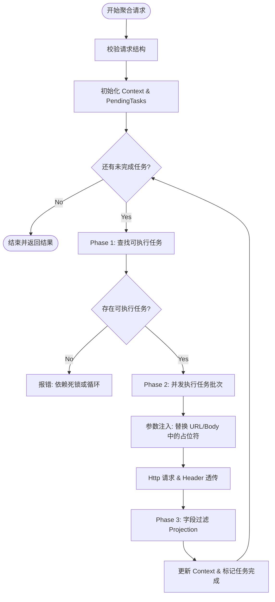

# CC 中间层（cc-proxy）详细设计与实现方案

## 1. 目标概述
构建一个名为 `cc-proxy` 的中间层服务模块，旨在作为客户端（Frontend/Client）与底层微服务之间的统一代理网关。它不包含具体业务逻辑，而是负责请求的编排、转发、聚合及基础数据处理。

**核心能力：**
1.  **智能转发**: 根据请求参数调用底层服务，自动透传关键上下文 Header (`authorization`, `app-id`, `resource-id`)。
2.  **请求聚合**: 支持一次调用并发获取多个底层接口数据 (Parallel Processing)。
3.  **依赖编排**: 支持基于前置条件的服务调用链 (Sequential/Dependency Flow)，例如：先调 A，成功后用 A 的结果调 B。
4.  **数据裁剪**: 支持类似 MongoDB 的字段投影 (Projection)，按需返回字段，减少网络传输。

---

## 2. 架构集成

### 2.1 模块位置
*   路径: `src/modules/cc-proxy/`
*   集成方式: 作为独立 Module 引入 `AppModule`。

### 2.2 核心依赖
*   `@nestjs/axios`: 处理 HTTP 请求。
*   `rxjs`: 处理异步流与并发（`forkJoin`, `lastValueFrom`）。
*   `lodash`: 处理对象深拷贝、字段选取 (`pick`, `omit`) 及路径解析 (`get`)。
*   `https-proxy-agent`: (可选) 如需通过代理访问外网服务。

---

## 3. 接口定义 (API Specification)

### 3.1 统一聚合接口 (POST `/cc/aggregate`)
此接口为核心入口，同时支持 **并发聚合** 和 **依赖编排**。

**请求结构 (Request Body):**
```json
{
  "commonHeaders": { "x-custom-global": "value" },
  "items": [
    {
      "id": "userProfile",
      "url": "http://user-service/users/me",
      "method": "GET"
    },
    {
      "id": "userOptLogger",
      "url": "http://order-service/orders",
      "method": "GET",
      "params": { "userId": "$userProfile.data.id" },
      "dependsOn": ["userProfile"], 
      "projection": { "include": ["orderId", "amount", "status"] }
    }
  ]
}
```

**响应结构 (Response Body):**
```json
{
  "success": true,
  "data": {
    "userProfile": { "code": 0, "data": { ... } },
    "userOptLogger": { "code": 0, "data": [ ... ] }
  },
  "errors": {} // 若 partial=true 且部分失败，此处记录错误
}
```

---

## 4. 详细实现逻辑

### 4.1 Header 透传机制
为了保证上下文（鉴权、租户信息）不丢失，CC 服务必须实现 Header 白名单透传。

*   **白名单**: `['authorization', 'app-id', 'resource-id', 'x-trace-id']`
*   **实现**: 在 Controller 层使用拦截器或装饰器提取这些 Headers，并在 Service 发起 `HttpService` 调用时注入到 `config.headers` 中。

### 4.2 依赖解析与执行引擎 (Dependency Engine)
为了实现 "接口 A 成功后调用接口 B" 的功能，采用 **多轮次执行算法**：

1.  **图构建**: 将 `items` 视为任务节点，`dependsOn` 视为有向边。
2.  **执行循环**:
    *   **Phase 1**: 找出所有 `dependsOn` 为空 或 `dependsOn` 所指任务已完成（且成功）的 **未执行** 任务。
    *   **Phase 2**: 并发执行这些任务（`Promise.all`）。
    *   **Phase 3**: 任务完成后，将结果存入 `Context` map。
    *   **Phase 4**: 检查是否还有剩余任务。如果有且本轮无任何任务执行（死锁），则报错退出；否则回到 Phase 1。
3.  **参数注入**: 在执行任务前，解析 `params` / `data` / `url` 中的动态占位符（如 `$userProfile.data.id`）。使用 `lodash.get(context, 'userProfile.data.id')` 获取前置任务结果。

### 4.3 依赖执行流程图 (Mermaid)



### 4.4 字段过滤 (Field Projection)
实现类似 MongoDB 的 Projection 逻辑。

*   **逻辑**:
    *   如果 `mode: 'include'`: 使用 `lodash.pick(data, fields)`。
    *   如果 `mode: 'exclude'`: 使用 `lodash.omit(data, fields)`。
*   **处理层级**:
    *   如果响应数据是 **对象**: 直接应用。
    *   如果响应数据是 **数组**: 遍历数组，对每个元素应用。
    *   如果响应数据包含标准包装（如 `{ code: 0, data: [...] }`）：智能识别 `data` 字段并应用过滤。

### 4.4 错误处理
*   **Strict Mode (默认)**: 任意一个任务失败 (HTTP 4xx/5xx)，整个聚合请求视为失败，抛出异常。
*   **Partial Mode (可选)**: 允许部分失败。失败的任务在响应 `errors` 字段中体现，依赖该失败任务的后续任务自动取消（标记为 Skipped）。

---

## 5. 类与接口设计 (Type Definitions)

### 5.1 DTO 定义 (`src/modules/cc-proxy/dto/cc-proxy.dto.ts`)

```typescript
import { IsString, IsOptional, IsEnum, IsArray, ValidateNested, IsObject } from 'class-validator';
import { Type } from 'class-transformer';

export enum HttpMethod {
  GET = 'GET',
  POST = 'POST',
  PUT = 'PUT',
  DELETE = 'DELETE',
}

export class ProjectionDto {
  @IsEnum(['include', 'exclude'])
  mode: 'include' | 'exclude';

  @IsArray()
  @IsString({ each: true })
  fields: string[];
}

export class ProxyRequestItemDto {
  @IsString()
  id: string; // 任务唯一标识

  @IsString()
  url: string;

  @IsEnum(HttpMethod)
  method: HttpMethod;

  @IsOptional()
  @IsObject()
  headers?: Record<string, string>;

  @IsOptional()
  @IsObject()
  params?: Record<string, any>; // Query Params

  @IsOptional()
  data?: any; // Body

  @IsOptional()
  @IsArray()
  @IsString({ each: true })
  dependsOn?: string[]; // 依赖的任务ID列表

  @IsOptional()
  @ValidateNested()
  @Type(() => ProjectionDto)
  projection?: ProjectionDto;
}

export class AggregateRequestDto {
  @IsArray()
  @ValidateNested({ each: true })
  @Type(() => ProxyRequestItemDto)
  items: ProxyRequestItemDto[];
  
  // 可选：是否允许部分成功
  @IsOptional()
  allowPartial?: boolean;
}
```

---

## 6. 开发计划

1.  **基础建设**:
    *   创建 `CcProxyModule`, `CcProxyController`, `CcProxyService`.
    *   配置 `HttpModule`。
2.  **核心逻辑实现**:
    *   实现 `executeRequest` 方法：处理单个 HTTP 请求 + Header 透传 + Projection 处理。
    *   实现 `resolveDependencies` 方法：解析任务依赖图。
    *   实现 `orchestrate` 方法：基于依赖图的循环调度执行。
3.  **安全性增强**:
    *   添加 URL 白名单校验（防止 SSRF 攻击内部非公开服务）。
    *   添加超时控制（Timeout Interceptor）。

---

## 7. 示例场景

### 场景 A：获取用户详情并过滤敏感信息
**Request Item:**
```json
{
  "id": "me",
  "url": "http://user-service/me",
  "method": "GET",
  "projection": { "mode": "exclude", "fields": ["password", "salt", "mobile"] }
}
```

### 场景 B：获取用户详情，成功后获取其关联的部门信息
**Items:**
1.  **Item 1 (User)**: `id: "user"`, `url: ".../me"`
2.  **Item 2 (Dept)**: `id: "dept"`, `url: ".../depts/$user.data.deptId"`, `dependsOn: ["user"]`

CC Service 将自动先执行 Item 1，提取结果中的 `data.deptId` 替换 Item 2 URL 中的变量，然后执行 Item 2。
